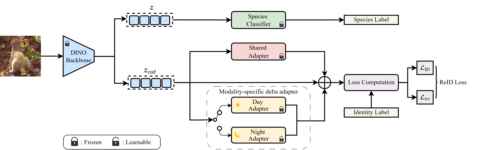

# SWIFT


SWIFT is a DINOv3-based framework for animal re-identification. It supports
zero-shot evaluation, adapter training, and adapter checkpoint inference for
researchers and practitioners working with animal re-ID datasets such as skink,
stoat, and cat.



The diagram shows how SWIFT combines a DINOv3 backbone with optional shared and
day/night adapters for animal re-identification.

## Installation

Create and activate a Python 3.10 environment:

```bash
conda create -n swift python=3.10 -y
conda activate swift
```

Install PyTorch and torchvision for your operating system and compute platform
using the official
[PyTorch installation guide](https://pytorch.org/get-started/locally/). Then
install the remaining Python dependencies:

```bash
pip install -r requirements.txt
```

SWIFT does not include DINOv3 source code or pretrained weights. Clone
[facebookresearch/dinov3](https://github.com/facebookresearch/dinov3), download
the required DINOv3 weights separately, and provide the relevant `REPO` and
`WEIGHT_PATH` values in the selected config or on the command line.

## Quick Start

Use this template for config overrides. Do not insert `--` before the trailing
config keys.

```bash
python train.py \
  --gpu <gpu_id> \
  --root <dataset_root> \
  --source-domains <source_domain> \
  --target-domains <target_domain> \
  --model-config-file <config_path> \
  MODEL.<ModelName>.REPO <dinov3_repo_path> \
  MODEL.<ModelName>.WEIGHT_PATH <dinov3_weight_path>
```

## Dataset Layout

Each dataset must contain flat `train`, `query`, and `gallery` directories:

```text
/path/to/datasets/
├── skink/
│   ├── train/
│   ├── query/
│   └── gallery/
├── stoat/
│   ├── train/
│   ├── query/
│   └── gallery/
└── Cat/
    ├── train/
    ├── query/
    └── gallery/
```

The `--source-domains` and `--target-domains` values should match the registered
domain names, for example `--source-domains cat --target-domains cat`.

## Configuration

The public configs are:

```text
config/zero_shot.yaml
config/adapter.yaml
config/adapter_inference.yaml
```

Each config contains required path placeholders. Replace them directly or
override them after the main command-line arguments.

### Day/Night Adapter

Day/night behavior is controlled by `MODEL.Day_Night_Adapter` in the adapter
configs. Set it to `True` for day/night delta adapters and `False` for a single
shared adapter. `AdapterInference` must use the same value used during training.

## Training and Evaluation

### Zero-Shot Evaluation

```bash
python train.py \
  --gpu 0 \
  --root /path/to/datasets \
  --source-domains skink \
  --target-domains skink \
  --model-config-file config/zero_shot.yaml \
  MODEL.ZeroShot.REPO /path/to/dinov3_repo \
  MODEL.ZeroShot.WEIGHT_PATH /path/to/dinov3_weights.pth
```

### Adapter Training

```bash
python train.py \
  --gpu 0 \
  --seed 42 \
  --root /path/to/datasets \
  --source-domains skink \
  --target-domains skink \
  --model-config-file config/adapter.yaml \
  MODEL.Adapter.REPO /path/to/dinov3_repo \
  MODEL.Adapter.WEIGHT_PATH /path/to/dinov3_weights.pth
```

Set `MODEL.Day_Night_Adapter False` at the end of the command to train without
day/night deltas.

### Adapter Inference

```bash
python train.py \
  --gpu 0 \
  --root /path/to/datasets \
  --source-domains stoat \
  --target-domains stoat \
  --model-config-file config/adapter_inference.yaml \
  MODEL.Adapter.REPO /path/to/dinov3_repo \
  MODEL.Adapter.WEIGHT_PATH /path/to/dinov3_weights.pth \
  MODEL.AdapterInference.ADAPTER_WEIGHTS /path/to/adapter_checkpoint.pth
```

Ensure `MODEL.Day_Night_Adapter` matches the checkpoint's training config.

## Outputs

Training logs, evaluations, and checkpoints are written to `./output` by
default. Use `--output-dir` to select another location.

## Repository Layout

```text
SWIFT/
├── config/                 # Public model configurations
├── datasets/               # Dataset registry and loaders
├── docs/                   # README images and documentation assets
├── evaluator/              # Re-identification evaluation
├── loss/                   # Training losses
├── metrics/                # Distance and ranking metrics
├── optim/                  # Optimizers and schedulers
├── trainer/
│   └── models/             # ZeroShot, Adapter, AdapterInference
├── train.py                # Training and evaluation entry point
└── requirements.txt
```
